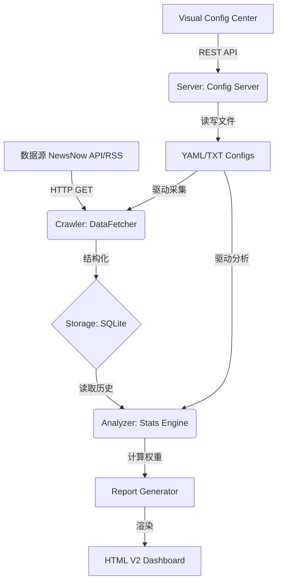

# AiYX Data Radar 项目复盘整合技术文档 / Consolidated Retrospective & Technical Manual

## 0. 文档说明 / Document Notes

本文档由以下两份历史文档整合而来，目标是形成一份去重后的统一技术复盘与维护手册：

- `docs/202603101128 Project_Retrospective.md`
- `docs/202603131205 Development_Retrospective.md`

整合原则：

1. 保留两份文档中的有效事实、关键时间线、架构说明、事故复盘和运维经验。
2. 对重复主题只保留一处权威描述，例如全局锁定、`/api/load`、`/api/save`、APPLY 应用同步、文件同步与部署。
3. 对后续文档已经覆盖或修正的内容，以后续状态为准，并说明演进关系。
4. 文档标题、说明和关键技术条目保持中英文对照，便于长期维护。

## 1. 元数据 / Metadata

### 1.1 创建记录 / Creation Record

- **整合日期 / Consolidation Date**: 2026-06-19
- **整合时间 / Consolidation Time**: 11:58
- **整合来源 / Sources**: 2026-03-10 项目复盘、2026-03-13 深度开发复盘
- **整合后文档 / Output Path**: `docs/202606191158_技术文档_项目复盘整合_V1.0.md`
- **原始创建人 / Original Creator**: Antigravity

### 1.2 历史更新时间线 / Historical Update Timeline

- **2026-03-10 11:30**: 创建项目复盘初版，记录框架说明、功能用途、文件路径及早期修复总结。
- **2026-03-10 17:00**: 增加三合一全量方案系统、全局锁定机制、实时配置读取及关键 Bug 修复总结。
- **2026-03-10 22:00**: 完成全局锁定机制优化、服务器配置读取/应用功能、UI 交互完整性修复。
- **2026-03-13 14:45**: 集成 AI 提示词编辑器及全站 7 大配色方案。
- **2026-03-14 12:00**: 增强 AI 渲染引擎，支持 Markdown 解析；优化模型选择器；记录 Docker 热更新排障经验。
- **2026-03-14 19:45**: 修复 AI 提示词 `[user]` 标签缺失；新增 SAVE & RUN 立即分析功能。
- **2026-03-14 20:00**: 优化编辑器导航栏排版；修复 AI 模型提供商缺失导致的 BadRequestError。
- **2026-04-09 09:55**: 优化 AI 分析卡片布局；修复模型名称显示为 Unknown；增强提示词分段逻辑。
- **2026-04-19 15:30**: 修复可视化配置中心锁定编辑功能；增强右侧配置面板禁用状态；修复 AI 提示词编辑器滚动同步。
- **2026-04-19 16:00**: 增强保存方案功能；支持方案列表显示和覆盖确认；品牌更新为 AiYX Data Radar。
- **2026-04-19 17:15**: 实现 AI 模型查询功能，支持多服务商连接测试、模型列表获取和自动配置填充。
- **2026-04-23 08:54**: 修复 Nginx 反向代理端口配置错误和数据库查询字段不匹配问题。
- **2026-04-24 15:52**: 修复配置文件读取失败，调整 `CONFIG_DIR` 路径检测顺序。
- **2026-04-24 16:30**: 优化 AI 模型查询弹窗，添加搜索过滤和可调整大小功能。
- **2026-04-26 21:40**: 修复手动刷新按钮失效和新增 RSS 源不显示问题。
- **2026-05-11 19:00**: 修复模型查询功能容器部署和多格式兼容性问题。
- **2026-06-19 12:05**: 固化 AI 模型查询 API Base 自动探测与自动写回能力，补齐接口响应字段、前端显示位置、持久化规则和事故复盘。

## 2. 技术栈与运行环境 / Tech Stack & Runtime

- **核心框架 / Core Framework**: Python 3.10+, HTML5, Vanilla CSS, Vanilla JavaScript
- **前端依赖 / Frontend Dependencies**: Tailwind CSS, FontAwesome 6.4.0, js-yaml 4.1.0, SortableJS 1.15.x, marked.js 12.0.0, html2canvas 1.4.1
- **后端服务 / Backend Service**: Custom SimpleHTTP Server (`docker/server.py`)
- **数据与配置 / Data & Config**: YAML/TXT 配置文件、SQLite、本地 profiles 快照
- **部署环境 / Deployment**: Docker 24.0+, Docker Compose, Nginx 1.24+
- **开发工具 / Dev Tools**: Linux, VSCode/Antigravity, Node.js 18.x, npm 9.x

## 3. 系统定位与核心能力 / System Positioning & Capabilities

AiYX Data Radar 是一个面向热点监控、新闻聚合、AI 分析和可视化配置管理的系统。系统从 NewsNow/RSS 等数据源采集内容，经过去重、排行、频率统计、AI 解读后生成可交互的 HTML 报告，并通过可视化配置中心管理运行参数。

核心能力包括：

- **热点采集与排行 / Hotspot Collection & Ranking**: 支持多平台新闻源采集、排名历史记录和热度计算。
- **配置管理闭环 / Config Management Loop**: 支持读取、编辑、锁定、保存、APPLY 应用和 SAVE & RUN 即时分析。
- **方案快照 / Profile Snapshots**: 支持将 `config.yaml`、`frequency_words.txt`、`timeline.yaml`、AI 提示词等文件打包保存为方案。
- **AI 分析 / AI Analysis**: 支持自定义提示词、Markdown 渲染、模型元数据传递、多服务商模型查询。
- **主题与导出 / Theme & Export**: 支持多套主题、长图导出和报告视觉增强。

## 4. 系统架构 / System Architecture



### 4.1 核心模块职责 / Core Module Responsibilities

- **`crawler/fetcher.py`**: 负责网络通信和 API 对接，包含自动重试、退避和 JSON 安全解析。
- **`core/analyzer.py`**: 负责关键词匹配、权重计算、RSS 频率统计和 AI 分析调度。
- **`report/html_v2.py`**: 负责主页报告渲染、主题系统、AI 内容渲染和前端交互注入。
- **`docker/server.py`**: 负责可视化配置中心 API，包括加载配置、保存配置、方案管理、模型查询和刷新触发。
- **`docker/manage.py`**: 负责触发采集和分析任务，是前端 SAVE & RUN 的后端执行入口。

## 5. 核心技术规格 / Technical Specifications

### 5.1 热度权重算法 / Weighting Algorithm

系统基于以下公式计算新闻热度，用于排序和热点判断：

```text
Total_Weight = (Rank_Score * 0.4) + (Freq_Score * 0.3) + (Hotness_Score * 0.3)
```

- **Rank_Score**: `Σ(11 - min(rank, 10)) / 出现次数`
- **Freq_Score**: `min(出现次数, 10) * 10`
- **Hotness_Score**: 高排名占比加成

### 5.2 数据库模式 / Database Schema

- **`news_items`**: 以 `url + platform_id` 为唯一索引，支持新闻无损去重。
- **`rank_history`**: 存储时间序列排名，用于生成热度走势。
- **`period_executions`**: 保证 `ONCE_PER_DAY` 逻辑，防止重复推送。
- **`ai_analysis_cache`**: 缓存 AI 分析结果，降低重复请求和 Token 消耗。

### 5.3 Web API / Web APIs

| 路径 / Path | 方法 / Method | 用途 / Purpose | 说明 / Notes |
| :--- | :--- | :--- | :--- |
| `/api/load` | GET | 读取配置文件 | 支持 config、frequency、timeline、AI prompt 等文件 |
| `/api/save` | POST | 保存配置文件 | 请求体包含 `file` 和 `content` |
| `/api/profiles/save` | POST | 保存方案快照 | 将多配置文件打包为 JSON 方案 |
| `/api/refresh` | POST | 立即触发数据刷新 | 用于 SAVE & RUN 闭环 |
| `/api/check_ai_connection` | POST | 测试 AI API 连通性 | 返回最终命中的兼容 API Base：`api_base`、`api_base_changed` |
| `/api/get_ai_models` | POST | 查询模型列表 | 支持多服务商、`/models` 与 `/v1/models` 自动探测，并返回最终命中的兼容 API Base |

## 6. 可视化配置中心 / Visual Config Center

### 6.1 配置文件范围 / Config File Scope

配置中心管理的主要文件包括：

- `config.yaml`: 全局行为和平台配置
- `frequency_words.txt`: 关键词与过滤配置
- `timeline.yaml`: 自动化执行时间表
- `ai_analysis_prompt.txt`: AI 解读提示词模板
- `ai_translation_prompt.txt`: AI 翻译提示词模板
- `profiles/`: 方案快照存储目录

### 6.2 配置管理闭环 / Config Management Loop

1. **读取 / Read**: 通过 `/api/load` 从服务器读取当前运行配置，回填左侧源码编辑器并同步到右侧可视化面板。
2. **编辑 / Edit**: 解锁后可修改源码编辑器或右侧可视化控件，系统实时保持双向同步。
3. **锁定 / Lock**: 默认锁定编辑，防止误操作；锁定时禁用修改类控件，但保留浏览和滚动能力。
4. **应用 / Apply**: 通过 `/api/save` 将编辑器内容保存到服务器配置文件。
5. **立即分析 / Save & Run**: 在保存后调用 `/api/refresh`，触发后台重新采集或分析，提供即时反馈。
6. **方案 / Profile**: 支持保存、覆盖、加载和回填方案快照，服务器端保留最近 5 个方案。

### 6.3 全局锁定机制 / Global Lock Mechanism

历史上全局锁定经历两轮修复：

- 早期修复重点是阻断 `input`、`select`、`textarea`、`button`、`label` 等元素，避免锁定状态下仍可通过 label 触发 checkbox。
- 后续修复进一步区分“禁用交互”和“保留滚动”，避免容器级 `pointer-events: none` 导致右侧面板无法滚动。

当前推荐策略：

- 在元素级禁用修改类控件，不在可滚动容器上直接使用全局 `pointer-events: none`。
- 对非表单交互元素使用 `pointer-events: none`、`opacity: 0.6` 和 `cursor: not-allowed`。
- 在动态 DOM 渲染后重新应用锁定状态，避免新增控件逃逸锁定。
- 所有编辑器类组件必须绑定 scroll 同步，尤其是 AI 提示词编辑器和 backdrop 高亮层。

### 6.4 APPLY 与 SAVE & RUN / Apply & Save and Run

APPLY 最初替换了“支持一下”按钮，用于将编辑器内容同步到后端配置文件。后续新增 SAVE & RUN，用于解决“提示词已保存但分析内容未刷新”的体验断点。

- **APPLY**: 保存配置，不一定触发采集或分析。
- **SAVE & RUN**: 保存配置后调用刷新接口，适合需要立即看到 AI 分析变化的场景。

### 6.5 方案管理 / Profile Management

方案管理从早期“三合一”配置包扩展为多文件快照：

- 早期范围：`config.yaml`、`frequency_words.txt`、`timeline.yaml`
- 当前范围：增加 `ai_analysis_prompt.txt`、`ai_translation_prompt.txt` 等 AI 相关配置
- 交互能力：保存方案列表展示、选择覆盖、覆盖确认、自定义名称、自动时间戳名称、服务器端容量控制

## 7. AI 分析与模型能力 / AI Analysis & Model Capabilities

### 7.1 AI 分析容错 / AI Analysis Fault Tolerance

- JSON 解析异常时，原始响应回退长度从 500 字符提升到 3000 字符，减少有效观点丢失。
- 即使模型返回非标准 JSON，也尽量保留核心分析内容给前端二次渲染。
- `AIAnalysisResult` 增加 `metadata` 字段，用于传递模型 ID 等运行态信息，修复前端显示 Unknown 的问题。
- 提示词允许 JSON 字段内部使用 Markdown 列表和 `\n` 换行，但最终输出仍应保持纯 JSON，不应包裹 Markdown 代码块。

### 7.2 提示词编辑 / Prompt Editing

配置中心增加 `ai_analysis_prompt.txt` 和 `ai_translation_prompt.txt` 专用 Tab，支持源码直编、APPLY 同步、拖拽覆盖和锁定保护。

一次关键问题是 `ai_analysis_prompt.txt` 缺失 `[user]` 标签，导致角色与任务边界不清，保存后分析效果不符合预期。修复后通过 SAVE & RUN 打通保存和立即分析链路。

### 7.3 模型查询 / Model Query

模型查询功能支持 SiliconFlow、OpenAI、DeepSeek、Zhipu 和自定义服务商。关键兼容策略包括：

- 支持 `data`、`models`、`result`、`items` 等不同列表字段。
- 支持 `id`、`model`、`name`、`model_id` 等不同模型 ID 字段。
- 当 `/models` 返回 HTML、404 或非 JSON 时，自动尝试 `/v1/models`。
- 解析外部响应前必须先判断内容类型和 JSON 有效性，避免出现 `Expecting value` 这类低信息量错误。

## 8. 主页视觉与主题系统 / Homepage UI & Theme System

- **设计主题 / Design Theme**: 明亮科技风，结合浅色底、霓虹强调色、玻璃拟态和卡片式信息呈现。
- **卡片布局 / Card Layout**: 新闻卡片与 AI 卡片统一 600px 高度，内部滚动，避免长内容撑开页面。
- **Markdown 渲染 / Markdown Rendering**: 通过 marked.js 渲染 AI 分析中的标题、列表、加粗和代码内容。
- **主题矩阵 / Theme Matrix**: 预设 Solarized、Nord、Dracula、Gruvbox、Monokai、Catppuccin 等主题方向。
- **状态持久化 / Persistence**: 通过 `localStorage` 保存主页和编辑器的主题选择。

## 9. 部署、同步与运维 / Deployment, Sync & Operations

### 9.1 文件同步 / File Synchronization

早期存在 `docs/` 开发环境和 `output/config_editor/` 生产环境两套目录不同步的问题。历史手动同步命令如下：

```bash
cp /TrendRadar/docs/index.html /TrendRadar/output/config_editor/index.html
cp /TrendRadar/docs/assets/script.js /TrendRadar/output/config_editor/assets/script.js
```

后续维护建议：

- 建立自动同步脚本或 CI 检查，避免修改开发目录后忘记同步生产目录。
- 对需要热更新的文件，确保 Docker volume 挂载路径与实际运行路径一致。
- 修改前端静态资源时通常无需重启容器；修改 Python 后端或报告模板时应重启相关容器。

### 9.2 Docker 与热更新 / Docker & Hot Reload

关键经验：

- Python 模块在容器启动时已加载，修改 `html_v2.py`、`server.py` 等后端文件后，需要重启容器。
- 容器工作目录必须和 volume 挂载路径一致。历史问题中，容器工作目录为 `/app/docker`，实际运行旧版 `/app/docker/server.py`，而新文件挂载在 `/app/server.py`，导致代码版本不一致。
- 推荐启动命令使用绝对路径，例如 `python3 /app/server.py`，或将 `working_dir` 设置为 `/app`。

### 9.3 Nginx 反向代理 / Nginx Reverse Proxy

历史 502 问题包含两类：

- **短暂 502**: `docker-compose restart` 期间服务启动空档导致，通常是瞬时现象。
- **配置错误 502**: Nginx 代理端口与 Docker 映射端口不一致，例如容器映射为 `127.0.0.1:8084:8080`，但 Nginx 指向了错误端口。

修复原则：

```nginx
proxy_pass http://127.0.0.1:8084;
```

修改后执行 `nginx -t` 校验配置，并 reload Nginx。

## 10. 异常处理与事故复盘 / Issues & Troubleshooting

### 10.1 右侧模块不同步 / Right Panel Desync

- **表现 / Symptoms**: 左侧 YAML 修改后，右侧面板没有同步更新。
- **原因 / Cause**: `syncYamlToUI` 中 CSS 选择器拼写错误，如 `#controls - ${key}` 多出空格。
- **修复 / Fix**: 修正为严格选择器，确保数据能映射到对应 HTML 元素。
- **预防 / Prevention**: 对配置字段和 DOM selector 建立单元测试或映射校验。

### 10.2 读取配置无响应 / Reload Silent Failure

- **表现 / Symptoms**: 点击读取当前配置后无响应。
- **原因 / Cause**: iframe 内部 `confirm()` 被浏览器安全策略拦截。
- **修复 / Fix**: 移除 confirm，改为直接执行并使用 `showToast` 反馈。
- **预防 / Prevention**: iframe 内避免依赖阻塞式浏览器弹窗。

### 10.3 锁定状态下仍可操作 / Lock State Escape

- **表现 / Symptoms**: 锁定状态下 checkbox、toggle switch 或 label 仍可触发。
- **原因 / Cause**: 只禁用了表单元素，没有处理关联 label 和动态生成元素。
- **修复 / Fix**: 扩展锁定范围到 label 和非表单交互元素，并在每次动态渲染后重新应用锁定状态。
- **预防 / Prevention**: 测试锁定功能时覆盖所有可见交互元素，包括图标、文本标签和动态项。

### 10.4 锁定后无法滚动 / Locked Panel Cannot Scroll

- **表现 / Symptoms**: 右侧配置面板在锁定状态下无法滚动。
- **原因 / Cause**: 容器级 `pointer-events: none` 同时禁用了滚动。
- **修复 / Fix**: 移除容器级 pointer-events，改为元素级禁用。
- **预防 / Prevention**: 明确区分“禁止修改”和“禁止浏览”，锁定不应破坏阅读能力。

### 10.5 读取配置功能理解偏差 / Config Read Misunderstanding

- **表现 / Symptoms**: “读取当前配置”只同步左侧编辑器到右侧面板，没有从服务器读取实际运行配置。
- **原因 / Cause**: 将“当前配置”误解为编辑器当前内容，而不是服务器 `/app/config/` 中的运行配置。
- **修复 / Fix**: 重写 `reloadAllConfigsFromServer()`，通过 `/api/load` 并行读取 config、frequency、timeline 等文件。
- **预防 / Prevention**: 函数名包含 `FromServer` 时，行为必须真正访问服务器数据源。

### 10.6 APPLY 错误处理不足 / Apply Error Handling

- **表现 / Symptoms**: 网络失败或部分文件保存失败时，界面提示不清楚。
- **原因 / Cause**: 初始实现只关注成功路径，缺少逐文件结果检查。
- **修复 / Fix**: 对每个 `/api/save` 响应检查 `success` 字段，区分全部成功、部分成功和全部失败。
- **预防 / Prevention**: 所有异步写入都必须提供明确用户反馈和可定位错误信息。

### 10.7 主题回归问题 / Theme Regression

- **表现 / Symptoms**: 修复 AI 渲染后，首页主题选择下拉框失效。
- **原因 / Cause**: 重构 `html_v2.py` 注入 marked.js 时误删 `setTheme` 和持久化逻辑。
- **修复 / Fix**: 恢复主题逻辑，并将主题功能视为模板核心组件。
- **预防 / Prevention**: UI 大改后必须回归测试主题、导出、刷新等核心功能。

### 10.8 模型名称 Unknown / Model Name Sync Issue

- **表现 / Symptoms**: AI 分析报告卡片显示模型为 Unknown。
- **原因 / Cause**: `AIAnalysisResult` 缺少 metadata，模型 ID 无法从 analyzer 传递到 HTML 渲染层。
- **修复 / Fix**: 增加 metadata 字段，返回前填充 `{"model": model}`，渲染层优先读取该字段。
- **预防 / Prevention**: 跨模块数据类预留 metadata/context 字段，支持未来扩展。

### 10.9 Nginx 502 / Nginx Bad Gateway

- **表现 / Symptoms**: 外部 HTTPS 访问返回 502，本地 `127.0.0.1:8084` 正常。
- **原因 / Cause**: Nginx proxy_pass 指向错误端口，与 Docker Compose 映射不一致。
- **修复 / Fix**: 将 proxy_pass 指向宿主机映射端口，并执行配置校验和 reload。
- **预防 / Prevention**: 修改端口映射时同步更新 Nginx 配置和部署文档。

### 10.10 数据库字段不匹配 / Database Field Mismatch

- **表现 / Symptoms**: 搜索 API 报错 `no such column: i.published_at`。
- **原因 / Cause**: `news_items` 没有 `published_at` 字段，实际使用 `first_crawl_time`。
- **修复 / Fix**: SQL 中使用 `i.first_crawl_time as published_at`，统一返回字段。
- **预防 / Prevention**: 维护数据库 Schema 文档，并为常用查询建立测试。

### 10.11 手动刷新失效与 RSS 源不显示 / Manual Refresh & RSS Display

- **表现 / Symptoms**: SAVE & RUN 或 Refresh 后无新数据；新增 RSS 源未显示。
- **原因 / Cause**: `manage.py` 硬编码 `/AIYXDATA-TRADAR`，生产容器路径为 `/app`；新增 RSS 源未加入显示白名单。
- **修复 / Fix**: 使用动态路径探测，并将 `huxiu`、`timednews` 加入 `display.standalone.rss_feeds`。
- **预防 / Prevention**: 禁止生产代码硬编码宿主机路径；新增 RSS 时提醒同步显示配置。

### 10.12 模型查询容器部署与多格式兼容 / Model Query Deployment & Compatibility

- **表现 / Symptoms**: 模型查询返回 `Expecting value`；重启容器后仍运行旧代码；8084 未监听。
- **原因 / Cause**: 容器工作目录、volume 挂载路径和端口映射不一致；不同 API 服务商返回格式不同。
- **修复 / Fix**: 用 docker-compose 重建容器，确保端口映射正确；复制新 `server.py` 到实际运行路径；增加多字段解析和 `/v1/models` 自动重试。
- **预防 / Prevention**: 使用绝对启动路径；统一容器生命周期管理；外部 API 响应先判类型再解析。

### 10.13 AI Base 可探测但未写回 / Detected API Base Not Persisted

- **表现 / Symptoms**: 用户已经配置大模型，但点击 `SAVE & RUN 立即分析` 时失败；连接测试或查询模型可成功，实际分析仍使用错误的根地址；部分服务根地址返回 HTML 页面，`/v1/models` 才返回 JSON 模型列表。
- **原因 / Cause**: 后端模型查询虽然能尝试 `/v1/models`，但没有把最终命中的 API Base 作为稳定字段返回；前端弹窗只显示模型列表，没有显示或写回“检测到的 API Base”；后续保存分析仍沿用用户最初输入的根地址。
- **修复 / Fix**: 在 `docker/server.py` 的 `/api/check_ai_connection` 与 `/api/get_ai_models` 中维护 `effective_api_base`，成功时统一返回 `api_base` 和 `api_base_changed`；在 `output/config_editor/assets/script.js` 与 `docs/assets/script.js` 中增加 `detectedApiBaseRow` 和 `applyDetectedApiBase(apiBase)`，连接测试和模型查询成功后立即显示检测到的地址，并写回 `input[data-path="api_base"]`。
- **位置 / Location**: 弹窗步骤 1 的连接信息区显示“检测到的 API Base”；右侧可视化配置面板的 `ai.api_base` 输入框同步更新；左侧 YAML 通过 `change` 事件同步。
- **持久化 / Persistence**: 自动写回只更新当前编辑器状态；用户点击 `APPLY 应用同步`、`SAVE & RUN 立即分析` 或 `保存方案` 后才写入服务器配置文件。该能力是固定功能，适用于所有已配置和新添加的 OpenAI-compatible 大模型。
- **模型 ID / Model ID**: 模型卡片选择必须保留服务返回的完整模型 ID，不允许裁剪前缀或改写为近似名称；第三方兼容接口通常要求精确模型名称。
- **预防 / Prevention**: 连接测试和模型查询必须使用同一套 Base 探测规则；所有模型查询响应文档必须包含 `api_base`、`api_base_changed`；验证时同时覆盖旧根地址、自动补 `/v1`、选择模型、APPLY/SAVE & RUN 持久化四个环节。
- **验证 / Verification**: `python -m py_compile docker/server.py`、`node --check output/config_editor/assets/script.js`、`node --check docs/assets/script.js` 均通过；本地接口验证中旧根地址自动修正为 `/v1`，模型列表返回 134 个模型。

## 11. 项目结构总览 / Project Structure Tree

```text
/TrendRadar
  ├── config/                    # 配置根目录 (Config Root)
  │   ├── config.yaml            # 全局行为控制 (Global Control)
  │   ├── frequency_words.txt    # 语义过滤引擎配置 (Filter Engine)
  │   ├── timeline.yaml          # 自动化执行时间表 (Schedule)
  │   ├── ai_analysis_prompt.txt # AI 解读提示词模板 (Analysis Prompt)
  │   ├── ai_translation_prompt.txt
  │   └── profiles/              # 方案快照存储空间 (Profile Snapshots)
  ├── docker/                    # 容器化组件 (Docker Components)
  │   ├── server.py              # API 处理器 (API Server)
  │   ├── manage.py              # 核心控制器 (Core Controller)
  │   └── docker-compose.yml     # 容器编排配置 (Compose Config)
  ├── trendradar/                # 业务逻辑层 (Business Logic)
  │   ├── crawler/               # 采集器 (Crawler)
  │   ├── core/                  # 统计分析与调度 (Core Engine)
  │   ├── storage/               # 存储抽象与实现 (Storage)
  │   └── report/                # 渲染器与模板 (Renderers & Templates)
  │       ├── html_v2.py         # 主页 V2 模板 (Homepage V2 Template)
  │       └── generator.py       # 报告生成器 (Report Generator)
  └── output/                    # 数据输出 (Output)
      ├── index.html             # 主仪表盘 (Main Dashboard)
      └── config_editor/         # 可视化配置中心 (Visual Config Center)
          ├── index.html         # 编辑器主页 (Editor UI)
          └── assets/            # 样式与脚本 (Assets)
```

## 12. 核心数据契约与开发范式 / Data Contracts & Development Paradigms

### 12.1 新闻条目 / NewsItem

系统内部流转的核心新闻结构定义在 `trendradar/storage/base.py`，关键字段包括：

- `title`: 新闻标题，也是用户可见的主要标识。
- `source_id`: 来源平台 ID，例如 `weibo`、`baidu`。
- `rank`: 当前排名。
- `ranks`: 历史排名列表，用于计算热度趋势。
- `rank_timeline`: 详细排名时间线，用于渲染趋势变化。

### 12.2 AI 分析结果 / AIAnalysisResult

AI 分析结果定义在 `trendradar/ai/analyzer.py`，包含多个分析模块和 `metadata` 字段。`metadata` 用于传递模型名称、运行参数等跨模块上下文，避免前端展示层丢失运行态信息。

### 12.3 新增推送渠道 / Adding a Notification Channel

1. 在 `trendradar/notification/senders.py` 中新增发送函数。
2. 在 `trendradar/notification/dispatcher.py` 的 `NotificationDispatcher` 中注册私有发送方法。
3. 在配置映射中增加对应字段，例如通过 `self.config.get("YOUR_SERVICE_URL")` 触发。

### 12.4 新增存储后端 / Adding a Storage Backend

1. 在 `trendradar/storage/` 下新增实现文件，并继承 `StorageBackend` 抽象基类。
2. 实现 `save_news_data`、`get_today_all_data` 等抽象方法。
3. 为查询字段和返回结构增加测试，避免再次出现字段不匹配问题。

## 13. 运维与调试速查 / Ops & Debugging Quick Reference

- **实时日志 / Follow Logs**: `docker logs -f aiyxdata_tradar`
- **最近日志 / Recent Logs**: `docker logs --tail 100 aiyxdata_tradar`
- **带时间戳日志 / Timestamped Logs**: `docker logs -t aiyxdata_tradar`
- **配置调试 / Debug Config**: 在 `config.yaml` 中设置 `DEBUG: true` 输出更详细的采集和 AI 请求日志。
- **DNS 问题 / DNS Issues**: Docker 内 AI 请求域名无法解析时，检查宿主机 `/etc/resolv.conf` 是否正确映射。
- **Markdown 渲染 / Markdown Rendering**: marked.js 依赖 `window.marked`，解析行为可在 `html_v2.py` 底部脚本中配置。

## 14. 整合结论 / Consolidated Conclusion

AiYX Data Radar 已从早期 TrendRadar 配置中心修复，演进为包含热点采集、可视化配置、AI 分析、主题系统、模型查询、方案管理和部署运维经验的完整分析终端。

本整合版已经覆盖两份历史文档的核心内容：

- 2026-03-10 文档中的配置管理闭环、锁定机制、APPLY 同步、早期事故复盘已整合进第 6、9、10 章。
- 2026-03-13 文档中的架构、AI、主题、模型查询、Nginx、数据库、运维调试内容已整合进第 4、5、7、8、9、10、11、12、13 章。
- 重复内容已按“后续修正优先”的原则合并，避免同一问题在多个章节中给出互相冲突的处理方式。

后续维护应优先更新本整合版，不再维护旧的两份历史复盘文件。
