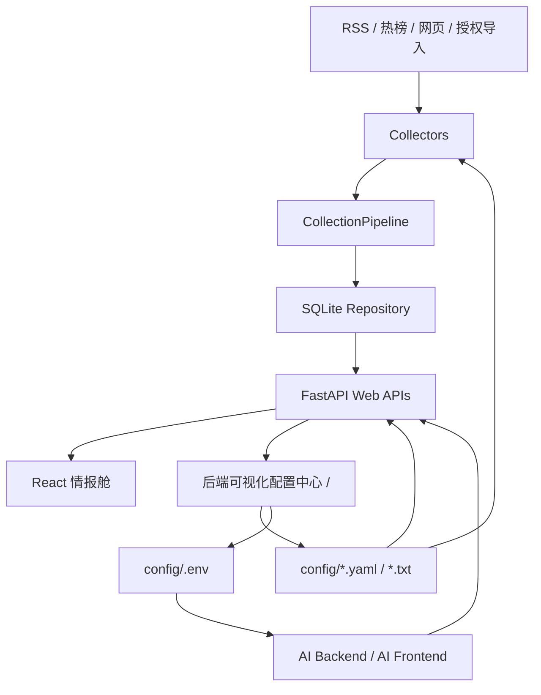

# AiYX Data Inteli 项目复盘整合技术文档 / Consolidated Retrospective & Technical Manual

## 0. 文档说明 / Document Notes

本文档是 `aiyx-data-inteli` 独立项目的复盘整合技术文档，参考 `docs/202606191158_技术文档_项目复盘整合_V1.0.md` 的章节结构，统一记录当前页面排版、视觉风格、功能、内容、路径、接口、配置文件、部署方式和近期问题修复结果。

整合原则：

1. 以当前项目 `D:/Docker/202607132101-aiyx-data-inteli-standalone` 的实际代码和运行路径为准。
2. 保留从 `AYX Growth Intel 可视化配置中心` 迁移来的功能边界，但按 `AiYX Data Inteli` 的前后端技术栈重新描述。
3. 明确前端情报舱、后端可视化配置中心、数据源、标签、关键词、时间线、大模型配置与密钥隔离的职责边界。
4. 所有接口、路径、文件名和容器名必须可直接用于排查、联调和后续维护。

## 1. 元数据 / Metadata

### 1.1 创建记录 / Creation Record

- **整合日期 / Consolidation Date**: 2026-07-14
- **整合时间 / Consolidation Time**: 21:02
- **项目根目录 / Project Root**: `D:/Docker/202607132101-aiyx-data-inteli-standalone`
- **输出路径 / Output Path**: `docs/202607142102_aiyx-data-inteli_技术文档_项目复盘整合_V1.0.md`
- **参考文档 / Reference Document**: `docs/202606191158_技术文档_项目复盘整合_V1.0.md`
- **当前前端入口 / Frontend URL**: `http://127.0.0.1:15179/`
- **当前后端入口 / Backend URL**: `http://127.0.0.1:18088/`

### 1.2 历史更新与本轮整合 / Historical Update Timeline

- **2026-07-13**: 创建 `aiyx-data-inteli-standalone` 独立 Docker 项目，前端、后端、数据卷和配置目录与旧容器解耦。
- **2026-07-14 早期**: 迁移 `202606100809-ayx-growth-intel` 中的数据源、标签、RSS、热榜和配置文件到当前 `config/` 目录。
- **2026-07-14 中期**: 前端情报舱补齐平台筛选、行业标签筛选、数据源固定标签、内容详情关系关键词、阅读/评论/转发指标和原文入口布局。
- **2026-07-14 后期**: 后端根路径 `/` 改为完整可视化配置中心，前端“配置中心”按钮直接跳转后端，不再弹出旧版数据源与标签弹窗。
- **2026-07-14 后期**: 后端配置中心补齐主要文件编辑、默认配置加载、方案保存、锁定编辑、频率词编辑、时间线调度、大模型 Provider、双 AI 角色、`.env` API Key 隔离、连接检测、模型列表读取和延迟颜色显示。

## 2. 系统定位与核心能力 / System Positioning & Capabilities

AiYX Data Inteli 是面向大消费、财经、科技和公共热点的多源商业情报系统。项目通过 RSS、热榜、网页采集和授权导入数据生成统一文章库，再通过关键词、行业标签、平台标签、风险等级、情绪和热度进行筛选、分析与报告生成。

核心能力：

- **多源采集 / Multi-source Collection**: 支持 `hotlist`、`rss`、网页情报采集和社媒授权数据导入。
- **标签体系 / Tag System**: `RSS源`、`热榜` 是数据源自身属性，属于固定标签；行业标签如财经、科技、文旅、消费等来自 `sources.yaml` 和频率词配置。
- **情报展示 / Intelligence Lens**: 前端提供按行业、按平台、按关键词三种筛选视角。
- **内容详情 / Selected Signal**: 详情面板展示来源标签、标题、发布时间、阅读/评论/转发/热度、打开原文、正文内容、内容关键词、后端数据源。
- **关系关键词 / Relation Keywords**: 从标题与正文中提取地点、品牌/关键词、人物，并在正文中用对应颜色高亮。
- **后端配置中心 / Backend Config Center**: 后端根路径承载完整配置中心，管理数据源、关键词、时间线、提示词、Provider、方案和默认配置。
- **双 AI 运行 / Dual AI Runtime**: 后台采集/分析/报告 AI 与前端交互 AI 独立配置，可使用同一 Provider，也可使用不同 Provider、模型、SOUL 和 API Key。

## 3. 技术栈与运行环境 / Tech Stack & Runtime

| 层级 / Layer | 技术 / Technology | 说明 / Notes |
| :--- | :--- | :--- |
| 前端 | React 19, TypeScript 5.8, Vite 5, lucide-react | 情报舱主界面，构建产物由 Nginx 容器服务 |
| 后端 | Python, FastAPI, Uvicorn | API 服务、配置中心 HTML、采集与报告触发 |
| 存储 | SQLite | `data/ayx_growth_intel.db`，保存 sources、articles、comments、metrics、chunks、jobs、reports |
| 配置 | YAML, TXT, `.env` | `config/` 下管理运行配置、数据源、频率词、时间线、提示词、模型 Provider |
| 部署 | Docker Compose | 后端容器 `aiyx-data-inteli-backend`，前端容器 `aiyx-data-inteli-frontend` |
| 前端端口 | `15179:80` | 浏览器访问 `http://127.0.0.1:15179/` |
| 后端端口 | `18088:8088` | 浏览器访问 `http://127.0.0.1:18088/` |

## 4. 系统架构 / System Architecture



### 4.1 核心模块职责 / Core Module Responsibilities

- `backend/ayx_growth_intel/api/main.py`: FastAPI 入口、业务 API、配置读写、AI Provider、模型检测、报告与采集触发。
- `backend/ayx_growth_intel/api/config_center_view.py`: 后端可视化配置中心 HTML、CSS、前端脚本。
- `backend/ayx_growth_intel/config.py`: 读取 `sources.yaml`、`.env` 和运行配置，完成后台 AI 配置优先级合并。
- `backend/ayx_growth_intel/storage.py`: SQLite schema、文章、指标、评论、报告运行记录和概览查询。
- `backend/ayx_growth_intel/pipeline.py`: 采集流程编排。
- `backend/ayx_growth_intel/collectors/`: RSS、热榜、网页情报、社媒导入采集器。
- `backend/ayx_growth_intel/analysis/`: 风险评分与日报生成。
- `frontend/src/main.tsx`: React 主界面、筛选逻辑、详情面板、关系关键词提取和配置中心跳转。
- `frontend/src/styles/app.css`: 前端情报舱视觉系统、卡片、标签、详情、关系关键词和响应式布局。

## 5. 页面排版、风格与元素 / Page Layout, Visual Style & Elements

### 5.1 前端情报舱页面 / Frontend Intelligence Cockpit

访问路径：`http://127.0.0.1:15179/`

页面结构：

1. **顶部品牌栏**: 显示 `AYX GROWTH INTEL · CONSUMER MARKET RADAR` 与 `大消费经济情报舱`，右侧提供刷新、配置中心、同步并生成按钮。
2. **运行流程区**: 展示数据采集、关键词匹配、舆情分析、报告生成四步流程。
3. **筛选区 / Intelligence Lens**: 三个视角按钮：按行业、按平台、按关键词；下方根据当前视角显示对应下拉选择。
4. **内容列表 / Evidence Stream**: 左侧主列表展示文章来源、固定标签、行业标签、风险、情绪、标题、发布时间、阅读、评论、转发、热度与摘要。
5. **内容详情 / Selected Signal**: 右侧详情卡片展示选中文章的完整信息。
6. **内容关键词 / Relation Panel**: 详情下方展示地点、品牌/关键词、人物、文章热度和正负情绪值。
7. **后端数据源 / Source Ledger**: 以轻量列表展示当前启用数据源及其固定标签和行业标签。

视觉规范：

- 主色：`#1f6bff`，深色按钮：`#0d1c32`，强调色：`#ff5722`。
- 页面使用明亮背景、低阴影、8px 左右圆角、紧凑信息密度。
- 标签使用浅色底和高对比文字，`RSS源`、`热榜` 作为固定数据源属性标签显示。
- 详情正文必须自动换行，只允许纵向滚动，不允许横向阅读。
- 关系关键词在正文中按类别高亮：地点、品牌/关键词、人物使用不同颜色。

### 5.2 后端可视化配置中心页面 / Backend Config Center

访问路径：`http://127.0.0.1:18088/`

入口规则：

- 前端“配置中心”按钮执行 `window.location.href = API_BASE + "/"`。
- 不再弹出前端旧版 `CONFIG CENTER 数据源与标签` 弹窗。
- 后端根路径 `/` 直接返回完整配置中心 HTML。
- 旧的后端 JSON 服务信息移动到 `/api`。

页面结构：

1. **顶部操作栏**: 读取配置、锁定编辑、加载默认、保存方案、复制、保存配置、SAVE & RUN、返回前端。
2. **指标卡片**: 配置文件、数据源、启用源、入库内容、高风险。
3. **左侧主要文件**: 列出 `config.yaml`、`sources.yaml`、`frequency_words.txt`、`timeline.yaml`、提示词、模型 Provider、行业词包、技能配置等。
4. **中间编辑器**: 原始 YAML/TXT 编辑区，支持重新读取、加载默认到当前文件、APPLY 应用同步。
5. **中间智能编辑区**: 根据文件类型显示结构化编辑器，例如频率词编辑、时间线调度、配置模块入口。
6. **右侧配置功能**: 大模型配置、关键词摘要、推送配置、数据源与标签、最新内容预览。

### 5.3 交互元素规范 / UI Element Rules

- 编辑默认锁定，用户必须点击“锁定编辑/解锁编辑”后才允许修改。
- 需要保存运行配置时使用“保存配置”；需要保存后立即触发采集/分析时使用 `SAVE & RUN`。
- 数据源固定标签不可依赖人工输入：`type=rss` 自动对应 `RSS源`，`type=hotlist` 自动对应 `热榜`。
- 大模型 Provider 和 Model 均使用下拉框，不使用卡片式选择。
- 自定义 Provider 在配置框架内展开，不使用浏览器 `prompt()` 或弹窗。
- API Base 右侧刷新图标用于检测连接；Model 右侧刷新图标用于读取可调用模型列表。
- API 延迟在 API Base 下方显示，颜色按延迟从深绿到深红过渡。

## 6. 功能模块 / Functional Modules

### 6.1 数据源与标签 / Sources & Tags

配置文件：`config/sources.yaml`

当前运行配置包含 30 个数据源，其中：

- `type=hotlist`: 11 个。
- `type=rss`: 18 个。
- 其余兼容类型按 `sources.yaml` 中实际 `type` 字段处理。

数据源字段：

| 字段 / Field | 说明 / Notes |
| :--- | :--- |
| `id` | 数据源唯一 ID |
| `name` | 页面显示名称 |
| `type` | `hotlist`、`rss` 或其他采集类型 |
| `platform` | 平台/分类基础属性 |
| `url` | RSS 或网页采集地址 |
| `tags` | 行业标签与固定标签 |
| `max_items` | 单次最大采集量 |
| `enabled` | 是否启用 |

前端筛选规则：

- 平台下拉来自所有启用数据源，不只来自已入库文章。
- 行业下拉来自数据源业务标签，不包含固定属性标签。
- 文章卡片显示数据源名称和完整标签。
- 搜索文本包含标题、摘要、平台、标签、匹配关键词、核心词。

### 6.2 内容详情与关系关键词 / Detail & Relation Keywords

前端文件：`frontend/src/main.tsx`

详情区域规则：

- 阅读、评论、转发、热度显示在发布时间下方，同一行排列。
- “打开原文”按钮显示在指标下方，不放入正文内容框。
- 正文内容框自动换行，按中文标点分段，只有上下滚动。
- 内容关键词区与详情卡片保持一致内边距和排版。

关系抽取规则：

- 地点：从候选地点词和正文中匹配，例如上海、中国、兰州、青海。
- 品牌/关键词：优先保留完整品牌词，例如 `烙色L'ADOR ECOLORS`、巴奴火锅、巴奴毛肚火锅、和府捞面、兰州拉面、青海拉面、兰州牛肉面、硬氪。
- 人物：提取博主、达人等上下文中的引号名称，例如“小黄鸭”“小易”“发梦冲”。
- 排除项：作者名、泛化技术词、无业务含义词不应进入人物或品牌列表。
- 高亮：正文中的地点、品牌/关键词、人物使用对应 `mark-*` 样式标注。

### 6.3 采集、分析与报告 / Collection, Analysis & Report

主要流程：

1. 前端点击“同步并生成”。
2. 调用 `/collect/run-all` 执行所有启用采集器。
3. 调用 `/reports/daily` 生成日报。
4. 调用 `/overview` 与 `/articles` 刷新页面内容。

风险与热度：

- 风险等级来自 `backend/ayx_growth_intel/analysis/scorer.py`。
- 文章热度按 0-100 显示，并在内容关键词区使用渐变条。
- 正负情绪值按 -10 至 +10 显示，并使用渐变条。
- 阅读、评论、转发优先使用 metrics 表；当指标字段为 0 时，前端从摘要中的“阅读数/评论数/播放数”等文本兜底解析。

### 6.4 频率词编辑 / Frequency Word Editing

配置文件：`config/frequency_words.txt`

后端配置中心在原始文本编辑器下方提供结构化编辑：

- 全局过滤词 `GLOBAL_FILTER` 增删。
- 关键词组增删。
- 组内关键词添加、删除、整理格式。
- 组标签勾选，至少一个分类标签。
- 支持 `/正则/`、`+必含词`、普通关键词和排除词。

### 6.5 时间线调度 / Timeline Scheduling

配置文件：`config/timeline.yaml`

后端配置中心提供：

- 当前 preset 显示。
- 预设模板选择。
- 自定义时间段添加，字段包含 key、名称、开始、结束。
- 采集、AI 分析、推送开关。
- 周视图展示深夜静默、工作日、晚间汇总等时间块。

### 6.6 方案、默认配置与锁定 / Profiles, Defaults & Lock

相关目录：

- `config/profiles/`: 用户保存的方案快照。
- `config/defaults/`: 默认配置文件。

规则：

- 页面默认锁定编辑，避免误改生产配置。
- 加载默认只影响当前文件内容，需要保存后才落盘。
- 保存方案用于保留一组配置快照。
- APPLY 用于将当前编辑内容保存到运行配置。
- SAVE & RUN 用于保存并触发刷新/采集/分析。

## 7. 大模型配置与双 AI 运行 / AI Model Configuration & Dual Runtime

### 7.1 Provider 与 Model / Provider & Model

配置文件：

- Provider 与可选模型：`config/ai_models.yaml`
- API Key 与运行密钥：`config/.env`
- 旧兼容字段：`config/sources.yaml` 中的 `ai_report`

内置 Provider：

- Kimi
- 智谱
- DeepSeek
- MiniMax
- OpenAI
- DashScope
- SiliconFlow
- SupXH Gemini
- 自定义 Provider

规则：

- Provider 使用下拉选择。
- Model 使用下拉选择。
- 自定义 Provider 在页面内联表单中新增，字段包括名称、API Base、模型 ID 列表。
- 同一 Provider 下模型 ID 不应重复。
- Provider 名称不应重复。
- API Key 不写入 YAML，只保存到 `config/.env`。

### 7.2 后台 AI 与前端交互 AI / Backend AI & Frontend AI

后端通过 `settings/runtime` 暴露两套 AI 角色：

| 角色 / Role | 环境变量前缀 | 职责 / Responsibility |
| :--- | :--- | :--- |
| 后台采集/分析/报告 AI | `AI_BACKEND_*` | 支撑后台采集、分析、日报生成 |
| 前端交互 AI | `AI_FRONTEND_*` | 支撑未来前端用户交互、问答和情报解释 |

`.env` 字段：

```text
AI_BACKEND_API_KEY=
AI_BACKEND_API_BASE=
AI_BACKEND_MODEL=
AI_BACKEND_TIMEOUT=
AI_BACKEND_SOUL=
AI_FRONTEND_API_KEY=
AI_FRONTEND_API_BASE=
AI_FRONTEND_MODEL=
AI_FRONTEND_TIMEOUT=
AI_FRONTEND_SOUL=
```

配置优先级：

1. `AI_BACKEND_*` 或 `AI_FRONTEND_*`
2. 兼容旧字段 `AI_API_KEY`、`AI_API_BASE`、`AI_MODEL`、`AI_TIMEOUT`
3. YAML 中的 `ai_report`
4. 代码默认值

### 7.3 连接检测、模型读取与延迟显示 / Connection, Model Loading & Latency

接口：

- `/api/check_ai_connection`: 根据 API Base 和 API Key 请求 OpenAI-compatible `/models`，返回成功状态、消息、模型数量和 `latency_ms`。
- `/api/get_ai_models`: 根据 API Base 和 API Key 读取可调用模型列表，失败时回退本地 Provider 模型列表。

交互规则：

- API Base 输入框右侧刷新图标：检测 API Base 与 API Key 是否匹配。
- Model 下拉框右侧刷新图标：读取当前 API Base/API Key 可调用模型并刷新下拉列表。
- 延迟显示在 API Base 下方，单位 ms。
- 颜色规则：
  - `< 100ms`: 深绿。
  - `< 200ms`: 绿色。
  - `200-299ms`: 浅绿。
  - `300-350ms`: 橙色警告。
  - `351-450ms`: 红色。
  - `> 450ms`: 深红。

## 8. Web API / Web APIs

| 路径 / Path | 方法 / Method | 用途 / Purpose | 说明 / Notes |
| :--- | :--- | :--- | :--- |
| `/` | GET | 后端可视化配置中心 | 返回完整 HTML，不再返回 JSON |
| `/api` | GET | 后端服务信息 | 返回 name、developer、health、docs、runtime_settings、frontend |
| `/health` | GET | 健康检查 | Docker 和运维检查使用 |
| `/settings/runtime` | GET | 运行配置 | 返回数据源、默认关键词、行业、AI 角色 |
| `/settings/config` | GET/POST | 兼容配置中心 | 读写 sources 配置 |
| `/config-files` | GET | 配置文件列表 | 返回主要配置文件、是否存在、默认文件状态 |
| `/api/load` | GET | 读取配置文件 | `file=config|sources|frequency|timeline|...` |
| `/api/save` | POST | 保存配置文件 | 写入 `config/` 下对应文件 |
| `/api/profiles/list` | GET | 方案列表 | 读取 `config/profiles/` |
| `/api/profiles/load` | GET | 加载方案 | 按名称读取方案内容 |
| `/api/profiles/save` | POST | 保存方案 | 保存当前配置快照 |
| `/api/refresh` | POST | 刷新触发 | 用于 SAVE & RUN |
| `/api/check_ai_connection` | POST | 检测 AI 连接 | 返回 success、message、latency_ms |
| `/api/get_ai_models` | GET/POST | 获取模型列表 | POST 可传 api_base、api_key、provider |
| `/api/ai-providers` | GET/POST | AI Provider 管理 | 读取/保存 `ai_models.yaml` |
| `/api/ai-settings` | POST | 保存 AI 设置 | 写入 `.env` 并同步必要配置 |
| `/api/report/latest_summary` | GET | 最新内容摘要 | 后端配置中心右侧预览使用 |
| `/api/web/terminal` | GET | Web 终端占位 | 兼容配置中心入口 |
| `/overview` | GET | 首页概览 | 返回 articles、high_risk、platforms 等 |
| `/articles` | GET | 文章列表 | 支持 `limit` 参数 |
| `/collect/run` | POST | 单任务采集 | 按关键词触发采集 |
| `/collect/run-all` | POST | 全源采集 | 对所有启用源执行采集 |
| `/reports/daily` | POST | 生成日报 | 根据关键词、核心词、行业生成报告 |

## 9. 配置文件范围 / Config File Scope

| 文件 / File | 用途 / Purpose |
| :--- | :--- |
| `config/config.yaml` | AYX 主配置，含基础设置、调度系统、模块化配置 |
| `config/sources.yaml` | AiYX Data Inteli 运行数据源、默认关键词、行业与旧兼容 AI 字段 |
| `config/frequency_words.txt` | 频率词、全局过滤词、关键词组和标签 |
| `config/timeline.yaml` | 推送与采集时间线 |
| `config/ai_analysis_prompt.txt` | 后台分析提示词 |
| `config/ai_translation_prompt.txt` | 翻译提示词 |
| `config/ai_models.yaml` | 大模型 Provider、Base URL 和可选模型 |
| `config/industry_packs.yaml` | 行业词包 |
| `config/skills.yaml` | 技能配置 |
| `config/.env` | API Key、AI 角色运行配置和敏感密钥 |
| `config/defaults/*` | 默认配置文件 |
| `config/profiles/*.yaml` | 方案快照 |

## 10. 数据契约 / Data Contracts

### 10.1 Article

前端 `Article` 主要字段：

- `url`
- `title`
- `platform`
- `source_id`
- `author`
- `summary`
- `published_at`
- `last_seen_at`
- `risk_level`
- `sentiment`
- `score`
- `read_count`
- `like_count`
- `comment_count`
- `share_count`
- `matched_keywords`
- `matched_core_terms`

### 10.2 RuntimeSettings

前端 `RuntimeSettings` 主要字段：

- `sources[]`: 数据源列表。
- `report_defaults.keywords[]`: 默认关键词。
- `report_defaults.core_terms[]`: 默认核心词。
- `report_defaults.industries[]`: 行业默认配置。
- `ai_report`: 旧兼容 AI 配置。
- `ai_roles.backend`: 后台 AI。
- `ai_roles.frontend`: 前端交互 AI。

### 10.3 SQLite Schema

`backend/ayx_growth_intel/storage.py` 初始化以下表：

- `sources`
- `articles`
- `comments`
- `metrics`
- `content_chunks`
- `crawl_jobs`
- `report_runs`

## 11. 部署、路径与运维 / Deployment, Paths & Operations

### 11.1 Docker Compose

文件：`docker-compose.yml`

容器：

- `aiyx-data-inteli-backend`
- `aiyx-data-inteli-frontend`

端口：

- 前端：`15179:80`
- 后端：`18088:8088`

挂载：

- `aiyx_data_inteli_data:/app/data`
- `./config:/app/config`
- `D:/Docker/202606100809-ayx-growth-intel/output/news:/app/legacy/news:ro`

启动命令：

```bash
docker compose up --build -d
```

停止命令：

```bash
docker compose down
```

### 11.2 本地开发命令

后端：

```bash
python -m ayx_growth_intel.api.main --config config/sources.yaml --host 0.0.0.0 --port 8088
```

前端：

```bash
cd frontend
npm install
npm run dev
```

构建验证：

```bash
cd frontend
npm run build
```

Python 编译检查：

```bash
python -m compileall backend/ayx_growth_intel
```

## 12. 项目结构总览 / Project Structure Tree

```text
/202607132101-aiyx-data-inteli-standalone
├── backend/
│   ├── ayx_growth_intel/
│   │   ├── api/
│   │   │   ├── main.py
│   │   │   └── config_center_view.py
│   │   ├── analysis/
│   │   ├── collectors/
│   │   ├── knowledge/
│   │   ├── config.py
│   │   ├── models.py
│   │   ├── pipeline.py
│   │   └── storage.py
│   ├── requirements.txt
│   └── tests/
├── config/
│   ├── config.yaml
│   ├── sources.yaml
│   ├── frequency_words.txt
│   ├── timeline.yaml
│   ├── ai_analysis_prompt.txt
│   ├── ai_translation_prompt.txt
│   ├── ai_models.yaml
│   ├── industry_packs.yaml
│   ├── skills.yaml
│   ├── .env
│   ├── defaults/
│   └── profiles/
├── data/
│   └── ayx_growth_intel.db
├── docker/
│   ├── Dockerfile.backend
│   ├── Dockerfile.frontend
│   └── nginx.conf
├── docs/
├── frontend/
│   ├── src/
│   │   ├── main.tsx
│   │   └── styles/app.css
│   ├── package.json
│   └── vite.config.ts
├── docker-compose.yml
├── pyproject.toml
└── README.md
```

## 13. 问题复盘与修复记录 / Issues & Troubleshooting

### 13.1 后端根路径仍显示 JSON

- **表现**: 访问 `http://127.0.0.1:18088/` 只显示后端服务 JSON。
- **原因**: 根路径仍是服务信息接口，配置中心没有融入后端页面。
- **修复**: `/` 改为返回 `render_backend_config_center()`；服务信息移动到 `/api`。
- **验证**: 浏览器访问 `/` 应显示 `AYX GROWTH INTEL · CONFIG CENTER` 可视化配置中心。

### 13.2 前端配置中心仍弹出旧窗口

- **表现**: 点击前端配置中心按钮弹出旧版“数据源与标签”弹窗。
- **原因**: 前端仍保留旧的 `configOverlay` 交互入口。
- **修复**: `openConfigCenter()` 改为跳转后端 `API_BASE + "/"`。
- **验证**: 点击配置中心后进入 `http://127.0.0.1:18088/`。

### 13.3 平台筛选缺少部分数据源

- **表现**: 已配置 11 个热榜、18 个 RSS，但平台筛选只显示少数平台。
- **原因**: 选项来源依赖已入库文章或部分运行数据。
- **修复**: 平台选项来自所有启用数据源；标签来自数据源配置。
- **验证**: 平台下拉应包含所有启用源名称。

### 13.4 标签没有显示固定属性

- **表现**: RSS、热榜没有作为标签显示。
- **原因**: 固定数据源属性被当成人工标签处理。
- **修复**: `type=rss` 自动补 `RSS源`，`type=hotlist` 自动补 `热榜`。
- **验证**: 文章卡片、详情卡片和数据源列表均显示固定标签。

### 13.5 内容详情横向滚动

- **表现**: 正文内容出现横向滚动条。
- **原因**: 长 URL 或长文本未强制换行。
- **修复**: 详情正文使用自动换行、段落分割和纵向滚动。
- **验证**: 正文只上下滚动，长 URL 不撑宽详情卡片。

### 13.6 阅读数显示为 0

- **表现**: 正文摘要中有阅读数，但指标卡片显示 0。
- **原因**: metrics 表字段为空时未从摘要文本兜底解析。
- **修复**: 前端增加 `displayReadCount`、`displayCommentCount`、`displayShareCount` 文本解析。
- **验证**: 摘要中 `阅读数: 23` 时卡片显示阅读 23。

### 13.7 品牌与人物抽取不完整

- **表现**: 烙色、巴奴火锅、和府捞面、兰州拉面等品牌未显示；博主“小黄鸭”“小易”等人物未提取。
- **原因**: 关系关键词候选词和上下文规则不足，且误把作者名当人物。
- **修复**: 增加品牌候选词、完整英文品牌保留、博主/达人引号名称抽取、作者名排除。
- **验证**: 内容关键词区显示完整品牌词，正文对应词高亮。

### 13.8 大模型配置缺少 KEY 与模型读取

- **表现**: 配置中心只显示简单模型字段，缺少 API Key、Provider、模型列表读取和自定义能力。
- **原因**: 后端页面尚未迁移旧版可视化配置中心的大模型模块。
- **修复**: 增加 Provider 下拉、Model 下拉、API Base、API Key、Timeout、SOUL、双 AI 角色、连接检测、模型读取和自定义 Provider。
- **验证**: API Key 保存到 `.env`；模型列表可通过刷新图标读取。

### 13.9 自定义模型使用浏览器弹窗

- **表现**: 点击自定义后出现浏览器原生 prompt。
- **原因**: 早期实现为了快速输入名称使用 `prompt()`。
- **修复**: 改为配置框架内联表单。
- **验证**: 自定义 Provider 不离开右侧配置面板，不出现浏览器弹窗。

### 13.10 检测连接按钮位置不符合要求

- **表现**: 检测连接是底部普通按钮。
- **原因**: 控件布局未按 API Base/Model 字段归位。
- **修复**: API Base 和 Model 右侧各放一个刷新图标按钮；底部重复按钮移除。
- **验证**: API Base 右侧检测连接，Model 右侧读取模型列表。

## 14. 维护规则与后续建议 / Maintenance Rules

- 新增数据源必须写入 `config/sources.yaml`，并明确 `type`、`platform`、`tags` 和 `enabled`。
- 固定标签由数据源 `type` 决定，不要求用户重复输入。
- 新增模型 Provider 必须写入 `config/ai_models.yaml`，API Key 只写入 `config/.env`。
- 修改配置中心功能时优先更新 `backend/ayx_growth_intel/api/config_center_view.py`，不要恢复前端弹窗配置中心。
- 修改前端详情布局时必须检查：指标同行、打开原文位置、正文自动换行、关系关键词内边距和高亮。
- 修改采集或数据库字段时必须同步 `/overview`、`/articles` 和前端 `Article` 类型。
- Docker 变更后使用 `docker compose up --build -d` 重建，并验证 `15179` 与 `18088` 两个入口。

## 15. 整合结论 / Consolidated Conclusion

AiYX Data Inteli 当前已经从单纯的数据源配置与文章展示，升级为前端情报舱加后端可视化配置中心的双页面系统。前端负责高密度情报浏览、筛选、关系关键词和报告触发；后端负责配置文件、数据源、标签、关键词、时间线、方案、默认配置和大模型运行环境。

本版文档覆盖当前项目的页面排版、风格、元素、功能、内容、路径、接口、配置文件、部署方式和近期修复记录。后续维护应优先更新本文档，而不是继续把 `AYX Growth Intel` 旧版文档当作当前项目的唯一技术说明。
